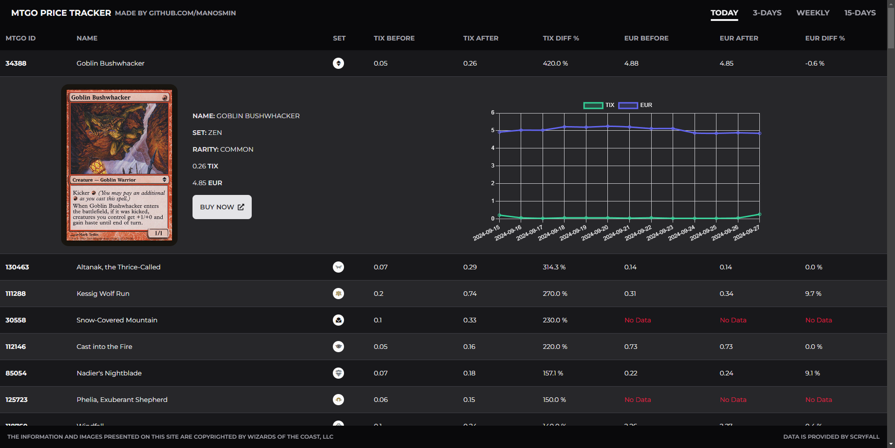

#  CardFlipMarket

CardFlipMarket is a website that discovers and shows the latest price spikes in a digital collectible card game, named [MTGO](https://www.mtgo.com/en/mtgo). Users can choose between different time ranges for price spikes, and can also see line charts with the full price history for the each one of the spiked cards. 

New price history data is automatically fetched from [Scryfall API](https://scryfall.com/docs/api) on a daily basis, and inserted into a database, in order to provide the most up-to-date card prices available.

Users can take advantage of this information, by anticipating similar price spikes in the real world and make data-driven decisions on whether to invest in the cards of the corresponding tabletop game.

The website is currently [live](https://cardflipmarket-manosmin.onrender.com/) on render.com, if anyone wants to give it a quick look instead of deploying it locally. 


## Tech stack

**Front End:** React.js, Tailwind CSS

**Back End:** Node.js, Express.js, MongoDB

**Libraries:** Chart.js, node-cron, mongoose, axios


## Project Tree

```bash
.
└── cardflipmarket/
    ├── node_modules
    ├── client/
    │   ├── node_modules
    │   ├── public
    │   ├── src/
    │   │   ├── components/
    │   │   │   ├── ChartPopover.js
    │   │   │   ├── Footer.js
    │   │   │   ├── Header.js
    │   │   │   └── Table.js
    │   │   ├── App.js
    │   │   ├── index.css
    │   │   ├── index.js
    │   │   └── tailwind.css
    │   ├── package-lock.json
    │   ├── package.json
    │   └── tailwind.config.js
    ├── config/
    │   └── db.js
    ├── controllers/
    │   └── oracleCardControllers.js
    ├── models/
    │   ├── OracleCard.js
    │   └── OracleCardPrices.js
    ├── routes/
    │   └── oracleCardRoutes.js
    ├── utils/
    │   ├── fetch.js
    │   ├── schedule.js
    │   └── upload.js
    ├── .env
    ├── .gitignore
    ├── index.js
    ├── package-lock.json
    └── package.json

```

In the root directory, there is a server file with an endpoint to hit on, and some folders for each one of specific tasks done in the back end.

* *config*→ Configures and connects to the database.
* *models*→ Schemas for card info and card price history documents.
* *routes*→ Configures and calls a specific controller when user hits the endpoint.
* *controllers*→ Functions that do certain operations in the database, when users ask for them.
* *utils*→ Necessary files needed in our application. More specifically:
    * *fetch.js*→ Fetches bulk data from Scryfall API *(using [axios](https://axios-http.com/docs/intro))*
    * *schedule.js*→ Processes cards data on a daily basis *(using [node-cron](https://www.npmjs.com/package/node-cron))*
    * *upload.js*→ Inserts and updates cards and price history collections in the database *(using [mongoose](https://mongoosejs.com/))*

The client directory is where the front end sits.

- *public*→ The index.html file and the website logo.
- *src*→ Source code for the application.
- *components*→ Different components of application, including the table where the cards data is shown and the price history chart.

## Environment Variables

Before you build the application, you should create an `.env` file in the root folder using your own variables, e.g.

`DB_URL = mongodb://localhost:27017/cardflipmarket_db`

`PORT = 5000`

`NODE_ENV = PRODUCTION`


## Run Locally

You should build both front and back end using 

```bash
  npm run build
```

Then, start the server

```bash
  node index.js
```

*Please note, that its normal for the the app to not show any data at the 1st day that you run it. You should wait 1 more day before new data is fetched and the 'today' price spikes are processed.*


## Screenshots

**Main Page**


**Price History Chart**


